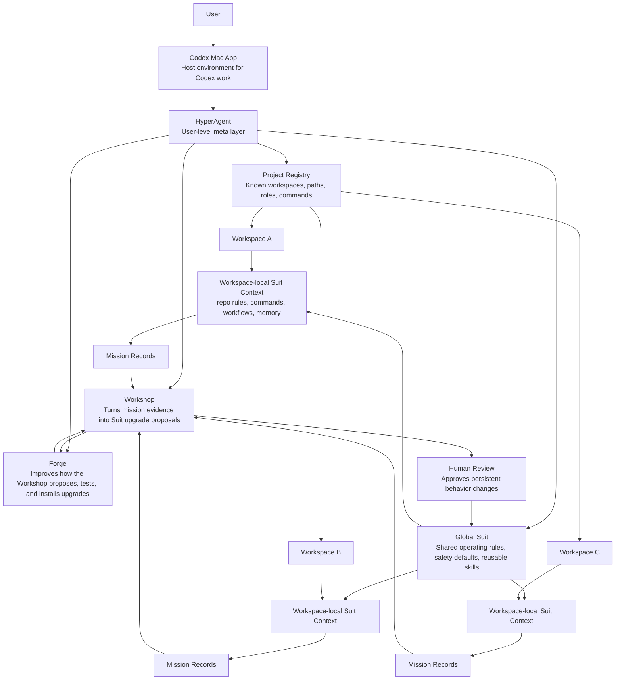

# HyperAgent

HyperAgent is an open source "Iron Man Suit" for AI agents: a local, inspectable operating layer that helps agents turn intent into reliable action.

The category claim is simple:

> Models provide intelligence. HyperAgent provides agency.

HyperAgent starts with OpenAI Codex in the Codex Mac app. The first prototype is intentionally markdown-first: Codex wears a Suit prompt while working, writes mission records after real tasks, and uses those records to propose evidence-backed upgrades through the Workshop. The Forge then reviews whether the Workshop itself is producing useful, safe, testable improvements.

## Architecture

HyperAgent is designed to sit at the Codex Mac app level as a user-level operating layer across Codex workspaces. The Global Suit provides shared operating rules, safety defaults, and reusable capabilities. Each workspace gets its own local Suit context for repo-specific rules, workflows, and memory.

Mission records capture evidence from real work. The Workshop turns that evidence into proposed Suit upgrades. The Forge improves the Workshop itself by checking whether proposals are specific, evidence-backed, safe, testable, and worth installing. Human review approves persistent behavior changes before they become part of the Suit.



## Quick Start

1. Clone this repo.
2. Install the Codex skill:

   ```bash
   sh scripts/install-codex-skill.sh "$HOME/.codex/skills"
   ```

   For local development, use `--symlink` instead of copying:

   ```bash
   sh scripts/install-codex-skill.sh --symlink "$HOME/.codex/skills"
   ```

   The installer validates `skills/codex-hyperagent/SKILL.md`, refuses to overwrite an existing skill unless `--force` is passed, and supports `--dry-run` for previewing the install.
3. Check local product status:

   ```bash
   sh scripts/hyperagent.sh status
   ```

4. Start Codex in this repo and ask it to use the `codex-hyperagent` skill.
5. Use `hyperagent/operating-prompt.md` as the canonical Suit prompt.
6. After a task, inspect the new mission record in `missions/`.
7. Inspect any evidence-backed upgrade proposals in `workshop/proposals/`.
8. Record explicit human approval or rejection in `workshop/decisions/` before a proposal becomes accepted Suit memory.

The MVP is file-based on purpose. There is no hosted service, no database, and no autonomous self-modification.

For the full first-run path, see `docs/quickstart.md`.

## What Is Included

- `docs/hyperagent-prd.md`: product requirements and milestone plan.
- `docs/concepts.md`: the Suit, Mission, Workshop, and Forge mental model.
- `docs/article-outline.md`: public essay outline for the Iron Man Suit thesis.
- `skills/codex-hyperagent/`: Codex skill instructions.
- `scripts/install-codex-skill.sh`: dependency-free Codex skill installer.
- `scripts/hyperagent.sh`: local helper for mission shells, proposals, Forge reviews, approval decisions, and status.
- `hyperagent/operating-prompt.md`: the operating layer Codex wears during work.
- `hyperagent/capability-registry.md`: accepted capability registry with reviewed local capabilities.
- `templates/mission-record.md`: mission telemetry template.
- `templates/upgrade-proposal.md`: Workshop proposal template.
- `templates/forge-review.md`: Forge review template.
- `templates/upgrade-decision.md`: human approval or rejection template.
- `workshop/backlog.md`: first-class upgrade backlog.
- `workshop/rubric.md`: proposal prioritization rubric.
- `forge/process/quality-rubric.md`: Forge quality metrics for improving Workshop output.
- `evals/`: small local checks for the Mission -> Workshop loop.

## Safety Model

The default activation mode is `human review required`.

Agents may propose upgrades freely and draft local, low-risk files when asked. They may not silently activate upgrades that increase permissions, alter secrets handling, change deployment behavior, broaden filesystem access, use new network/account access, or persist new operating rules. Until stronger policy automation exists, persistent behavior changes require explicit human approval.

## Verification

Run the local MVP verifier:

```bash
sh scripts/verify-mvp.sh
```

The verifier checks that the Codex skill, installer, operating prompt, local memory directories, templates, documentation, capability registry, and safety defaults are present.

Run the end-to-end local smoke loop:

```bash
sh evals/smoke-loop.sh
```

The smoke loop copies the repo to a temporary directory, creates a mission record, creates a proposal linked to that mission, creates a Forge review, records a human-review decision, and verifies the accepted capability appears in the registry.

## Current Limits

HyperAgent Mark I is a working local prototype. It does not provide a UI, autonomously modify itself, or support every agent platform yet. The point of this version is to prove the Mission -> Workshop -> Forge loop with durable local artifacts and explicit human review.

## License

HyperAgent is available under the MIT License. See [LICENSE](LICENSE) for details.
