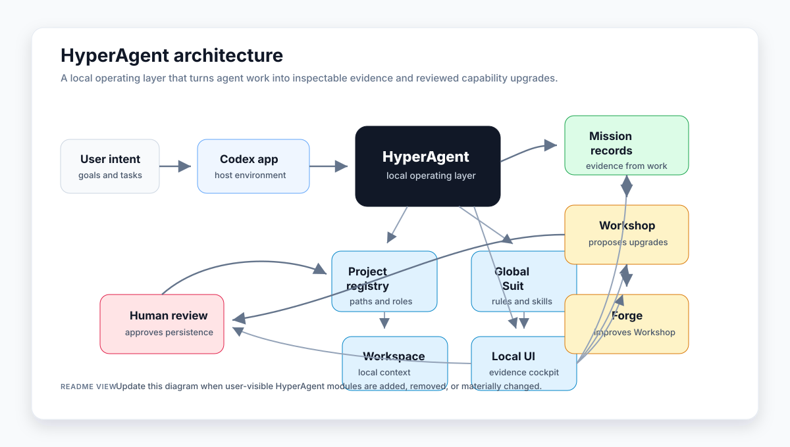

# HyperAgent

HyperAgent is an open source "Iron Man Suit" for AI agents: a local, inspectable operating layer that helps agents turn intent into reliable action.

The category claim is simple:

> Models provide intelligence. HyperAgent provides agency.

HyperAgent starts with OpenAI Codex in the Codex Mac app. The first prototype is intentionally markdown-first: Codex wears a Suit prompt while working, writes mission records after real tasks, and uses those records to propose evidence-backed upgrades through the Workshop. The Forge then reviews whether the Workshop itself is producing useful, safe, testable improvements.

## Alpha Status

HyperAgent is currently `v0.1.0-alpha`: a developer preview for testing the local Mission -> Workshop -> Forge loop.

This alpha is ready for early open-source use by Codex users who are comfortable with local markdown artifacts and shell scripts. It is not a hosted service, does not provide an interactive product UI or dashboard, does not support every agent platform, and does not autonomously modify itself.

Release notes: `docs/releases/v0.1.0-alpha.md`

Current product state and roadmap: `docs/roadmap.md`

## Architecture

HyperAgent is designed to sit at the Codex Mac app level as a user-level operating layer across Codex workspaces. The Global Suit provides shared operating rules, safety defaults, and reusable capabilities. Each workspace gets its own local Suit context for repo-specific rules, workflows, and memory.

Mission records capture evidence from real work. The Workshop turns that evidence into proposed Suit upgrades. The Forge improves the Workshop itself by checking whether proposals are specific, evidence-backed, safe, testable, worth installing, and actually improving behavior after acceptance. Forge reviews use anchored 0-5 scores, evidence references, deterministic gates, and small payoff counters so the process can be inspected over time. `forge audit` adds a concise process-health check for stale decisions, weak proposals, traceability gaps, and eval coverage. Human review approves persistent behavior changes before they become part of the Suit.

<p align="center">
  
</p>

<p align="center">
  <sub>Editable diagram source: <a href="docs/architecture/hyperagent.mmd">docs/architecture/hyperagent.mmd</a></sub>
</p>

## Try HyperAgent In Codex Mac

If you want the command path first, run this in Terminal:

```bash
/bin/sh -c 'set -eu; dest="${HYPERAGENT_HOME:-$HOME/HyperAgent}"; if [ -d "$dest/.git" ]; then git -C "$dest" pull --ff-only; else test ! -e "$dest" || { echo "Refusing to replace non-repo path: $dest" >&2; exit 1; }; git clone https://github.com/DannyMac180/HyperAgent "$dest"; fi; sh "$dest/scripts/setup-hyperagent.sh" --install-dir "$dest"'
```

This clones or updates HyperAgent, runs local verification, installs or updates the `codex-hyperagent` skill, and leaves global Codex custom instructions untouched. Project initialization is opt-in; pass `--init-target /path/to/project` to `scripts/setup-hyperagent.sh` when you want the script to ask before initializing a target repo.

For the assisted path, copy this prompt into the Codex Mac app:

```text
I want to try HyperAgent with Codex.

Use this GitHub repo as the source of truth:
https://github.com/DannyMac180/HyperAgent

Please set HyperAgent up on this machine.

Use `~/HyperAgent` as the default local install location. If that path already exists and is not a HyperAgent repo, stop and ask me before changing anything.

Do the following:

1. Check whether `git` and `sh` are available, and create `~/.codex/skills` if needed.
2. Clone HyperAgent into `~/HyperAgent` if it is not already there.
3. If HyperAgent is already cloned there, update it with `git pull --ff-only`.
4. Run `sh scripts/verify-mvp.sh` from the HyperAgent repo. If the repo is healthy and the checks are relevant, also run the local smoke tests.
5. Install or update the `codex-hyperagent` skill in my local Codex skills directory. If an existing skill is present, inspect it before replacing it.
6. If I am currently inside a project repo, ask me whether to initialize HyperAgent in that repo.
7. If I confirm, run the HyperAgent project init flow for that repo.
8. Verify that the skill exists after installation.
9. Tell me exactly what changed, what passed, and whether I need to restart Codex Desktop or open a fresh thread before the skill appears.

Do not modify my global Codex custom instructions. If you think a manual custom-instructions change is required, tell me exactly what to add and wait for me.

If there is any step Codex cannot complete automatically, stop and tell me the exact manual step I need to take.
```

Codex should do the setup work for you. It will clone or update this repo, run local verification, install the Codex skill, and ask before initializing HyperAgent inside another project.

The MVP is file-based on purpose. There is no hosted service, no database, and no autonomous self-modification.

For the manual and one-command setup paths, see `docs/quickstart.md`.

The primary CLI model has five flows:

```bash
sh scripts/hyperagent.sh init --target /path/to/project
sh scripts/hyperagent.sh sense
sh scripts/hyperagent.sh mission closeout --request "Describe the task" --slug task-slug
sh scripts/hyperagent.sh review workshop --mission missions/MISSION.md --title "Improve the Suit" --problem "Concrete mission friction"
sh scripts/hyperagent.sh ui
```

Development helpers such as `status`, `doctor`, `new-mission`, `mission-closeout`, `propose-upgrade`, `new-forge-review`, `forge audit`, and `decide-upgrade` remain available as compatibility aliases for at least one release.

For the project config contract, see `docs/config.md`.

For clean-install acceptance testing, see `docs/clean-install-uat.md`.

For two-week developer dogfooding from a fresh install, see `docs/dogfooding.md`.

For early release readiness, see `docs/release-checklist.md`.

## Updating

HyperAgent updates use normal Git workflows.

For copy installs:

```bash
git pull
sh scripts/update-codex-skill.sh
sh scripts/verify-mvp.sh
```

For symlink installs:

```bash
git pull
sh scripts/verify-mvp.sh
```

Restart Codex Desktop or open a fresh thread after updating the installed skill.

## What Is Included

- `docs/hyperagent-prd.md`: product requirements and milestone plan.
- `docs/concepts.md`: the Suit, Mission, Workshop, and Forge mental model.
- `docs/config.md`: `.hyperagent` schema, stable fields, adapter-owned fields, and verification command contract.
- `adapters/contract.md`: generic adapter contract for future platform work.
- `adapters/codex.md`: Codex-specific adapter responsibilities for the current alpha.
- `docs/clean-install-uat.md`: repeatable clean-install acceptance test for the README prompt.
- `docs/dogfooding.md`: two-week fresh-install dogfooding guide for PRD faithfulness review.
- `docs/evidence-policy.md`: committed-versus-local mission evidence policy, redaction checklist, and public example rules.
- `docs/release-checklist.md`: alpha release criteria, clean-clone test, and update model.
- `docs/releases/v0.1.0-alpha.md`: first alpha release notes.
- `docs/releases/next-alpha.md`: unreleased next-alpha notes.
- `docs/roadmap.md`: product-state source of truth for shipped, accepted, in-review, deferred, and stale surfaces.
- `docs/article-outline.md`: public essay outline for the Iron Man Suit thesis.
- `skills/codex-hyperagent/`: Codex skill instructions.
- `bin/hyperagent`: small command wrapper for `scripts/hyperagent.sh`.
- `.hyperagent`: machine-readable project config for initialized paths, adapters, and verification commands.
- `scripts/setup-hyperagent.sh`: one-command HyperAgent setup path for clone/update, verification, skill install, and optional project init.
- `scripts/install-codex-skill.sh`: dependency-free Codex skill installer.
- `scripts/update-codex-skill.sh`: update helper for copy installs.
- `scripts/hyperagent.sh`: runtime helper organized around five user-facing flows: `init`, `sense`, `mission`, `review`, and `ui`. Existing development commands remain available as compatibility aliases. Initialized projects get a small shim that delegates to this runtime.
- `.hyperagent-evidence/`: ignored local runtime evidence, including the opt-in command/check log used by `sense`.
- `hyperagent/operating-prompt.md`: the operating layer Codex wears during work.
- `hyperagent/capability-registry.md`: accepted capability registry with reviewed local capabilities.
- `templates/mission-record.md`: mission telemetry template.
- `templates/upgrade-proposal.md`: Workshop proposal template.
- `templates/forge-review.md`: Forge review template for outcome, proposal, eval, safety, process bloat, structured summary, gates, and payoff metrics.
- `templates/upgrade-decision.md`: human approval or rejection template.
- `workshop/backlog.md`: first-class upgrade backlog.
- `workshop/rubric.md`: proposal prioritization rubric.
- `forge/process/quality-rubric.md`: Forge quality metrics for improving Workshop output.
- `evals/`: small local checks for the Mission -> Workshop loop.
- `docs/examples/missions/`: public-safe sample mission records that demonstrate the loop without private local context.

## Safety Model

The default activation mode is `human review required`.

Agents may propose upgrades freely and draft local, low-risk files when asked. They may not silently activate upgrades that increase permissions, alter secrets handling, change deployment behavior, broaden filesystem access, use new network/account access, or persist new operating rules. Until stronger policy automation exists, persistent behavior changes require explicit human approval.

## Verification

Run the local MVP verifier:

```bash
sh scripts/hyperagent.sh verify-config
sh scripts/verify-mvp.sh
```

The config verifier checks the root `.hyperagent` contract. The MVP verifier checks that the Codex adapter docs, Codex skill, installer, operating prompt, local memory directories, templates, documentation, capability registry, and safety defaults are present.

Run the end-to-end local smoke loop:

```bash
sh evals/smoke-loop.sh
```

The smoke loop copies the repo to a temporary directory, creates a mission record, creates a proposal linked to that mission, creates a Forge review, creates a process-improvement proposal linked to that Forge review, records a human-review decision, and verifies the accepted capability appears in the registry.

Run the Forge audit smoke eval:

```bash
sh evals/forge-audit-smoke.sh
```

The audit smoke eval uses one complete proposal fixture and one intentionally weak proposal fixture to verify that `forge audit` catches proposal-quality and decision-handoff problems while keeping generated process proposals `human review required`.

Run the project init smoke test:

```bash
sh evals/init-smoke.sh
```

The init smoke test creates a temporary repo, runs `hyperagent init`, checks the generated markdown-first structure and `.hyperagent` config, verifies that global runtime files are not copied into the target, verifies `--update`, verifies overwrite refusal, verifies `--force`, and confirms `--dry-run` leaves the target untouched.

Run the HyperAgent setup smoke test:

```bash
sh evals/setup-hyperagent-smoke.sh
```

The setup smoke test installs the Codex skill into a temporary skills directory, confirms project init only happens after an explicit yes, and checks dry-run clone/install reporting.

Run the sensing smoke test:

```bash
sh evals/sense-smoke.sh
```

The sensing smoke test records passed and failed checks, verifies changed-file detection, checks Markdown and JSON summaries, and confirms secret-like command fragments are redacted.

## Current Limits

HyperAgent Mark I is a working local prototype. It includes a static README architecture visual and local markdown/shell workflows, but it does not provide an interactive product UI, autonomously modify itself, or support every agent platform yet. The point of this version is to prove the Mission -> Workshop -> Forge loop with durable local artifacts and explicit human review.

For the current status of `init`, `sense`, reliability evals, Forge checks, and other newer surfaces, see `docs/roadmap.md`.

## License

HyperAgent is available under the MIT License. See [LICENSE](LICENSE) for details.
