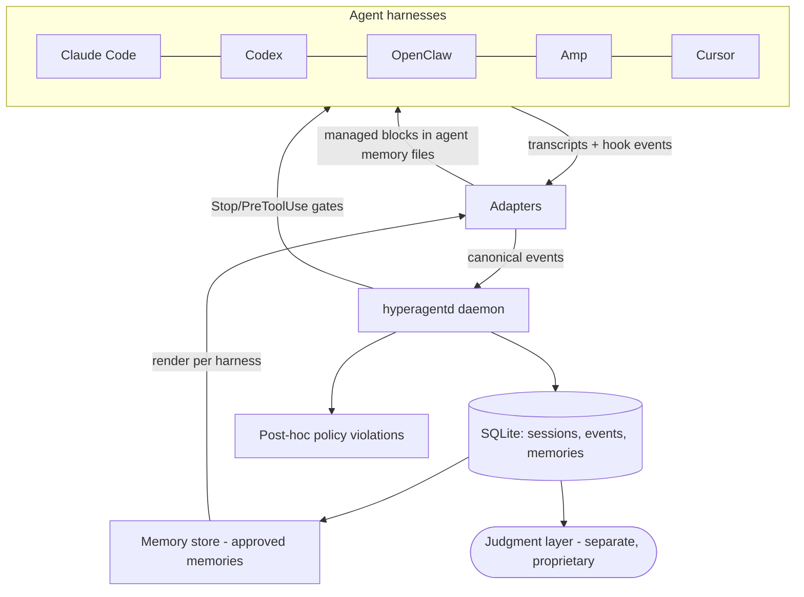

# HyperAgent v2 Architecture — The Meta-Harness

> **This is rationale, not current state.** It records why v2 is shaped the way it is, decided 2026-07-26 — not what is built and working today. For that, read `README.md` for the shape, `docs/capability-matrix.md` for what is actually verified (generated by a live conformance run), and each subsystem doc for its own honest gap list: `docs/schema.md`, `docs/gates.md`, `docs/memory.md`. Where any of those disagree with this document about present behavior, they are right and this one is dated.
>
> **Scope:** the open data plane only. Since the open-core split on 2026-07-28, the judgment layer above the store — scoring, improvement proposals, decay auditing, the desktop app — is a separate proprietary product and is not documented here; §6.6 marks the seam and `docs/open-core.md` states what falls on each side.
>
> Where this document conflicts with the v1 PRD (archived 2026-08-03 at `docs/archive/hyperagent-prd-v1.md`) or the v1 implementation, this document wins. The PRD's vision, safety doctrine, and Suit/Workshop/Forge vocabulary carry forward; the v1 mechanism does not.
>
> **Provenance:** Distilled from a full-codebase review of v1 (2026-07-26) and the rearchitecture design session that followed.

## 1. Why v2

The v1 review found a disciplined markdown-and-shell governance framework whose central mechanism defeats the product vision: **the working agent is asked to operate its own suit.** It must voluntarily write mission records, voluntarily log commands via `hyperagent check`, and voluntarily propose upgrades. The consequences, measured over 78 days of self-hosted use:

- ~60 of 66 missions closed with no Workshop handoff; the auto-closeout template filled in the agent's own judgment fields with boilerplate.
- The full improvement loop (friction → proposal → decision → installed capability → measurably better next mission) never once completed.
- No code path observed an agent or invoked a model; "sensing" read only what the agent chose to record.
- The suit was Codex-only, and attachment depended entirely on the model choosing to follow markdown instructions.

Instructions telling a model *how to behave* are exactly the layer that decays as models improve — the scaffold trap the PRD warns against. v2 removes that layer entirely.

## 2. The core principle

**The pilot flies; the suit records.** The working agent carries zero HyperAgent ceremony — no closeout commands, no self-assessment, no operating doctrine telling it how to work. Everything HyperAgent knows, it learns by observing the agent harness's own telemetry: transcripts, lifecycle hooks, and filesystem/git effects. Observation is involuntary and after-the-fact; enforcement happens at harness hook points, not through prose.

This is durable because it builds on the three interfaces every serious agent harness now exposes, which are converging rather than diverging:

1. **Transcripts on disk** (Claude Code session JSONL, Codex rollouts, OpenClaw/Amp session stores).
2. **Lifecycle hooks** (pre/post tool-use and stop events that an external program can observe and, on some harnesses, block).
3. **Instruction and tool injection** (AGENTS.md / CLAUDE.md conventions, skills directories, MCP).

## 3. The reframe: one suit, many bodies

Agents are becoming interchangeable bodies; HyperAgent is the nervous system that persists across them. A user running Claude Code, Codex, OpenClaw, Amp, and Cursor today abandons everything each agent learned whenever they switch. The meta-harness inverts that: accumulated memory, policy, and telemetry become the durable user-owned asset, switching agents becomes cheap, and every additional agent feeds the shared layer more data. No single vendor has an incentive to build this: cross-vendor neutrality is the whole point, and it is the one property a model vendor cannot offer.

## 4. The durability test (admission rule)

Every capability the suit installs must be one of four things the model cannot get better at on its own, because they are external to the model:

| Class | Examples | Why it survives model improvement |
|---|---|---|
| **Ground truth** | Repo gotchas, user preferences, correction history | A smarter model still doesn't know *your* history |
| **Actuation & permission** | Safety gates that block actions at hooks | A smarter model still shouldn't have unreviewed prod access |
| **Measurement** | Verification contracts, session scoring, replay evals | Self-grading never becomes trustworthy; an external referee always helps |
| **Persistence** | Anything that must survive across sessions and vendors | Context windows reset; the suit doesn't |

**Corollary:** anything that tells the model how to think or work ("plan first", "make focused changes") is rejected from the registry. Models already do this and will do it better next quarter.

## 5. System overview

The `Judgment layer` node is where this repository stops. Anything that reads the store and forms an opinion about it lives outside the MIT boundary; see `docs/open-core.md`.

## 6. Components

### 6.1 Canonical event schema (build first)

One vendor-neutral session model that every adapter translates into, stored in local SQLite. This is the LSP move: N adapters × M features becomes N + M because everything downstream is written once against the schema and is vendor-blind.

Core entities (to be specified precisely in `docs/schema.md` as the first engineering deliverable):

- `session` — agent, model, harness version, repo, start/end, outcome.
- `turn` — user message / agent response boundaries; user corrections flagged.
- `tool_call` — name, input digest, result status, duration, files touched.
- `error` / `retry` — failures and recovery attempts.
- `completion_claim` — what the agent said it accomplished.
- `verification_event` — checks that ran (tests, builds, gates) and their results.

Design constraints: append-only event log; adapters may emit partial data (schema fields are optional by tier); schema versioned independently of the app so it can become an open standard for agent telemetry.

### 6.2 `hyperagentd` — the observer daemon

A local Bun/TypeScript background process (launchd on macOS). Watches transcript directories via file events, subscribes to hooks where available, normalizes into the canonical schema. Local-first: nothing leaves the machine.

- Anything that summarizes or grades a session is **derived from the transcript** after the session ends, never written by the working agent. The daemon exposes a session-end hook for that work; it does not perform it.
- Adapter breakage is a normal event, not an exception: per-adapter version detection, and a visible "adapter needs update" state instead of silent data loss.

### 6.3 Adapters — the three-verb contract

Every adapter implements up to three capabilities, with graceful degradation:

- **Observe** — locate and parse the harness's transcripts into canonical events.
- **Inject** — deliver memory, skills, and tools into the agent's context (instruction files, skills dirs, MCP).
- **Gate** — intercept and block actions in real time (hooks, permission configs), where the harness allows it.

The 2026-07-26 fleet assessment that opened this work — kept here as the design input it was, **not** as a capability claim:

| Harness | Expected observe surface | Expected inject surface | Expected gate surface |
|---|---|---|---|
| Claude Code | Full JSONL + lifecycle hooks | CLAUDE.md, skills, MCP | Blocking hooks |
| OpenClaw | Open-source, hackable | AGENTS.md-style, MCP | Plausible, unexamined |
| Codex | Session rollouts | AGENTS.md, skills | Approval config only |
| Amp | Thread storage | AGENTS.md | None found |
| Cursor | Weak (app-internal) | Rules files | None found |

> **This table asserts no tiers.** Tier is earned, not assessed: `docs/capability-matrix.md` is the only authority on what any harness actually supports, and it is generated by a live conformance run. Where the two disagree, the matrix wins and this table is stale design input. The assessment has already been wrong once in each direction — Codex's gate surface turned out to be inject-only in practice, and Claude Code's tier held only after 19 checks proved it.

An **adapter conformance suite** feeds a recorded session through an adapter and verifies canonical-event output, injection round-trip, and (if claimed) gating. A capability is verified only when at least one real check passes for it; storage-trait gating marks structurally inapplicable checks `not-applicable` rather than silently passing them. Adapters are the community contribution surface.

### 6.4 Memory engine

Vendor-neutral store; per-adapter **renderers** compile relevant memories into each harness's native dialect (managed CLAUDE.md block, AGENTS.md section, Cursor rules, MCP recall tool).

- Every memory carries: evidence links back to the transcript moments that taught it, scope (global / repo / agent — some lessons are about a specific harness's quirks), confidence, and a decay clock.
- A memory becomes eligible for injection only through an explicit status transition — `approve`, `reject`, `retire` — and the store refuses to change status any other way. Where candidates come from is outside this repository; that the transition is an authority boundary is not.
- The cross-agent transfer is the product's defining demo: a lesson learned in one agent's session is present in every other agent's next session.

### 6.5 Gates and verification contracts

The enforcement organ, running at harness hook points where available:

- **Verification contracts**: per-repo definition-of-done checks evaluated at Stop — did tests actually run, does the diff match the completion claim, were untouched-file promises kept. Failures bounce back to the agent in-flight rather than nagging the user.
- **Safety policy**: written once, compiled per harness — real PreToolUse blocks where hooks exist; permission-config settings where they don't; and **post-hoc detection** everywhere (the observer flags policy violations in transcripts even when it couldn't block, surfaced in the Cockpit).
- v1's authority-boundary doctrine (propose freely; never silently broaden permissions, secrets handling, or access; human review for persistent changes) carries forward unchanged — as code instead of prose.

### 6.6 Where the data plane ends

Everything above lives in this repository under MIT. Above the store sits a separate judgment layer — session scoring, improvement proposals, decay auditing, and a desktop app — which reads the canonical event schema and nothing else. It is a proprietary product and is not documented here. `docs/open-core.md` states what falls on each side of that line and why the observation half is the open half.

The seam is typed and deliberately narrow: `IngestOptions.scorer` / `missionQueue` / `memoryQueue` in `src/daemon/ingest.ts`, plus `WatchPlugins` and `runCli(args, extraCommands, watchPlugins)` in `src/daemon/cli.ts`. With no plugins passed the daemon is a complete, standalone flight recorder — observe, store, gate, inspect. That is the intended free product, not a degraded mode of a larger one, and changes to the seam are treated as public interface changes.

## 7. What carries forward from v1, what dies

**Carries forward:** the Suit/Workshop/Forge vocabulary and story; the mission-record, proposal, and decision formats (as generated outputs); the evidence policy; the safety/authority doctrine; the eval discipline (redirected at replay evals and adapter conformance); roadmap governance style.

**Dies:** the 3,764-line bash CLI (surviving logic rewritten in TypeScript); the operating prompt's how-to-work instructions; all voluntary self-reporting (`mission closeout`, `check`, `record-check` as agent-facing ceremony); hand-authored eval fixtures as reliability proof; per-mission Workshop ceremony.

## 8. Build order

Each stage is independently shippable; never more than one stage from something usable. These are the data-plane stages — judgment-plane work interleaves with them and is not tracked here.

1. **Canonical schema + SQLite store** — everything else's interface.
2. **`hyperagentd` + Claude Code adapter** — best observation surface (hooks + JSONL) and the primary dogfooding environment, so dogfooding becomes automatic rather than a discipline.
3. **Memory store + injection renderers** — first felt improvement; the cross-agent demo.
4. **Verification contracts + safety gates.**
5. **Codex adapter** (parity for the v1 audience), then OpenClaw, Amp, Cursor — each earning whatever tier its conformance run proves.

Stages 1 through 4 have shipped; the Codex adapter has shipped at Tier 2. `docs/capability-matrix.md` is the authority on what is actually verified.

## 9. Open questions

- **Transcript formats beyond the two shipped adapters.** Answered for Claude Code and Codex: both formats parse cleanly across every CLI version present on the dogfooding machine, and both adapters are version-detecting. Open for OpenClaw, Amp, and Cursor, whose surfaces have never been examined in code.
- **Hook depth on OpenClaw and Amp** — whether either can gate at all, or is inject-only in practice as Codex turned out to be. Unexamined.
- **Whether the canonical schema should be published as a standalone spec**, separately from this repository, and how early.
- **Transcript durability** — the record indexes vendor-owned artifacts the vendor may rotate or delete. See `docs/schema.md` §8, where the gap and its current disposition are recorded.

Answered since this document was written, kept here so the questions are not re-opened: the tier-before-matrix ordering concern is closed structurally — the generated matrix asserts tiers only for harnesses a conformance run has measured. The v1 repo-hygiene items are closed by the v1 retirement (2026-08-03).
