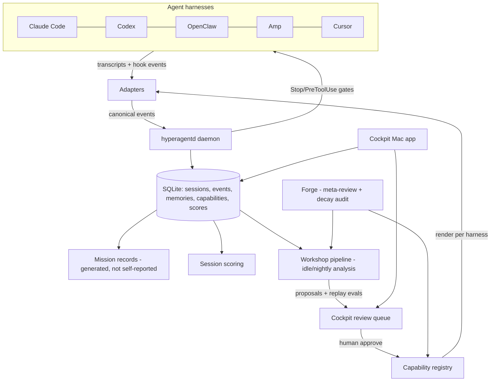

# HyperAgent v2 Architecture — The Meta-Harness

> **Status:** Accepted direction, 2026-07-26. This document is the source of truth for the HyperAgent rearchitecture. Where it conflicts with `docs/hyperagent-prd.md` or the v1 implementation, this document wins. The PRD's vision, safety doctrine, and Suit/Workshop/Forge vocabulary carry forward; the v1 mechanism does not.
>
> **Provenance:** Distilled from a full-codebase review of v1 (2026-07-26) and the rearchitecture design session that followed. Linear tickets for each workstream live in the DAN project "HyperAgent".

## 1. Why v2

The v1 review found a disciplined markdown-and-shell governance framework whose central mechanism defeats the product vision: **the working agent is asked to operate its own suit.** It must voluntarily write mission records, voluntarily log commands via `hyperagent check`, and voluntarily propose upgrades. The consequences, measured over 78 days of self-hosted use:

- ~60 of 66 missions closed with no Workshop handoff; the auto-closeout template filled in the agent's own judgment fields with boilerplate.
- The full improvement loop (friction → proposal → decision → installed capability → measurably better next mission) never once completed.
- No code path observed an agent or invoked a model; "sensing" read only what the agent chose to record.
- The suit was Codex-only, and attachment depended entirely on the model choosing to follow markdown instructions.

Instructions telling a model *how to behave* are exactly the layer that decays as models improve — the scaffold trap the PRD warns against. v2 removes that layer entirely.

## 2. The core principle

**The pilot flies; the suit records.** The working agent carries zero HyperAgent ceremony — no closeout commands, no self-assessment, no operating doctrine telling it how to work. Everything HyperAgent knows, it learns by observing the agent harness's own telemetry: transcripts, lifecycle hooks, and filesystem/git effects. Observation is involuntary and after-the-fact; enforcement happens at harness hook points, not through prose.

This is durable because it builds on the three interfaces every serious agent harness now exposes, which are converging rather than diverging:

1. **Transcripts on disk** (Claude Code session JSONL, Codex rollouts, OpenClaw/Amp session stores).
2. **Lifecycle hooks** (pre/post tool-use and stop events that an external program can observe and, on some harnesses, block).
3. **Instruction and tool injection** (AGENTS.md / CLAUDE.md conventions, skills directories, MCP).

## 3. The reframe: one suit, many bodies

Agents are becoming interchangeable bodies; HyperAgent is the nervous system that persists across them. A user running Claude Code, Codex, OpenClaw, Amp, and Cursor today abandons everything each agent learned whenever they switch. The meta-harness inverts that: accumulated memory, policy, and telemetry become the durable user-owned asset, switching agents becomes cheap, and every additional agent feeds the shared layer more data. No single vendor can build this — cross-vendor neutrality is the moat.

## 4. The durability test (admission rule)

Every capability the suit installs must be one of four things the model cannot get better at on its own, because they are external to the model:

| Class | Examples | Why it survives model improvement |
|---|---|---|
| **Ground truth** | Repo gotchas, user preferences, correction history | A smarter model still doesn't know *your* history |
| **Actuation & permission** | Safety gates that block actions at hooks | A smarter model still shouldn't have unreviewed prod access |
| **Measurement** | Verification contracts, session scoring, replay evals | Self-grading never becomes trustworthy; an external referee always helps |
| **Persistence** | Anything that must survive across sessions and vendors | Context windows reset; the suit doesn't |

**Corollary:** anything that tells the model how to think or work ("plan first", "make focused changes") is rejected from the registry. Models already do this and will do it better next quarter.

## 5. System overview

## 6. Components

### 6.1 Canonical event schema (build first)

One vendor-neutral session model that every adapter translates into, stored in local SQLite. This is the LSP move: N adapters × M features becomes N + M because everything downstream — memory extraction, scoring, Workshop, Cockpit, decay audits — is written once against the schema and is vendor-blind.

Core entities (to be specified precisely in `docs/schema.md` as the first engineering deliverable):

- `session` — agent, model, harness version, repo, start/end, outcome.
- `turn` — user message / agent response boundaries; user corrections flagged.
- `tool_call` — name, input digest, result status, duration, files touched.
- `error` / `retry` — failures and recovery attempts.
- `completion_claim` — what the agent said it accomplished.
- `verification_event` — checks that ran (tests, builds, gates) and their results.

Design constraints: append-only event log; adapters may emit partial data (schema fields are optional by tier); schema versioned independently of the app so it can become an open standard for agent telemetry.

### 6.2 `hyperagentd` — the observer daemon

A local Bun/TypeScript background process (launchd on macOS). Watches transcript directories via file events, subscribes to hooks where available, normalizes into the canonical schema. Local-first: nothing leaves the machine.

- Mission records still exist as human-readable markdown — but they are **generated from the transcript** after a session ends (by a cheap model dispatched through the user's own agent CLI), never written by the working agent.
- Session scoring runs on the same trigger: evidence-backed completion, intervention count, retries, verification pass rate. Scores accumulate into per-agent, per-repo trend lines.
- Adapter breakage is a normal event, not an exception: per-adapter version detection, and a visible "adapter needs update" state instead of silent data loss.

### 6.3 Adapters — the three-verb contract

Every adapter implements up to three capabilities, with graceful degradation:

- **Observe** — locate and parse the harness's transcripts into canonical events.
- **Inject** — deliver memory, skills, and tools into the agent's context (instruction files, skills dirs, MCP).
- **Gate** — intercept and block actions in real time (hooks, permission configs), where the harness allows it.

Capability tiers (initial fleet assessment, to be verified per adapter):

| Harness | Observe | Inject | Gate | Tier |
|---|---|---|---|---|
| Claude Code | Full JSONL + lifecycle hooks | CLAUDE.md, skills, MCP | Blocking hooks | 1 — full suit |
| OpenClaw | Open-source, hackable | AGENTS.md-style, MCP | Likely achievable | 1 — full suit |
| Codex | Session rollouts | AGENTS.md, skills | Approval config only | 2 — observe + inject |
| Amp | Thread storage | AGENTS.md | No | 2 |
| Cursor | Weak (app-internal) | Rules files | No | 3 — inject-only |

An **adapter conformance suite** feeds a synthetic session through an adapter and verifies canonical-event output, injection round-trip, and (if claimed) gating. Adapters are the community contribution surface; a public capability matrix documents each harness's tier.

### 6.4 Memory engine

Vendor-neutral store; per-adapter **renderers** compile relevant memories into each harness's native dialect (managed CLAUDE.md block, AGENTS.md section, Cursor rules, MCP recall tool).

- Every memory carries: evidence links back to the transcript moments that taught it, scope (global / repo / agent — some lessons are about a specific harness's quirks), confidence, and a decay clock.
- Promotion pipeline: observed pattern → candidate memory → (auto or human-approved per policy) → injected. Low-risk factual memories may auto-promote; behavior-shaping memories require review.
- The cross-agent transfer is the product's defining demo: a lesson learned in one agent's session is present in every other agent's next session.

### 6.5 Gates and verification contracts

The enforcement organ, running at harness hook points where available:

- **Verification contracts**: per-repo definition-of-done checks evaluated at Stop — did tests actually run, does the diff match the completion claim, were untouched-file promises kept. Failures bounce back to the agent in-flight rather than nagging the user.
- **Safety policy**: written once, compiled per harness — real PreToolUse blocks where hooks exist; permission-config settings where they don't; and **post-hoc detection** everywhere (the observer flags policy violations in transcripts even when it couldn't block, surfaced in the Cockpit).
- v1's authority-boundary doctrine (propose freely; never silently broaden permissions, secrets handling, or access; human review for persistent changes) carries forward unchanged — as code instead of prose.

### 6.6 Workshop — a pipeline, not a prompt

Runs on idle or nightly, dispatched through the user's own installed agent CLI (headless `claude -p` / `codex exec`) so the suit's cognition rides the user's existing subscription at zero marginal cost.

1. Cluster friction across many sessions (single sessions rarely justify upgrades — v1's data proved it).
2. Draft upgrades: new memory, new verification check, new skill, instruction edit — each admitted only if it passes the durability test (§4).
3. Attach a **replay eval** to every proposal: re-run captured failing scenarios against the upgraded suit. Real fixtures from real history — no hand-authored circular evals.
4. Land proposals in the Cockpit review queue for one-click approve/reject. Approved upgrades enter the capability registry and are rendered into harnesses by the adapters.
5. Post-install measurement: session scores before vs. after, per capability. An upgrade that doesn't move the needle is flagged for retirement.

### 6.7 Forge — meta-review and the decay audit

The Forge audits the Workshop (proposal acceptance rates, eval quality, specificity) as in v1 — but its signature v2 capability is the **decay audit**: every installed capability carries a falsifiable "still needed?" test. Periodically, the Forge replays scenarios *without* a given capability and checks whether the current model still fails. When a model has outgrown a crutch, the suit retires it — per agent, since Claude may outgrow a capability Codex still needs.

This is the anti-scaffold property made mechanical: **a scaffold accumulates; this suit sheds weight as the pilot gets stronger.**

### 6.8 Cockpit — the Mac app

The paid product surface and the non-engineer's entire experience of HyperAgent:

- Menu bar presence; detects installed agents and attaches with one click — no terminal required.
- Dashboard: what your agents did, per-agent/per-repo score trends, policy violations, comparative agent performance ("in this repo, Codex wins on test-writing; Claude Code on debugging").
- Review queue: approve/reject Workshop proposals; memory browser with evidence links; capability registry with decay-audit status.
- Read-mostly over the local SQLite + markdown artifacts; markdown remains inspectable ground truth (v1's principle, kept).

## 7. Cross-vendor measurement

Because every agent's sessions score through one rubric, the meta-harness produces data no vendor can: comparative agent performance on the user's own workload. This powers routing recommendations, per-agent decay audits, and the Cockpit's comparative dashboard. It exists only at the meta level — a structural moat.

## 8. What carries forward from v1, what dies

**Carries forward:** the Suit/Workshop/Forge vocabulary and story; the mission-record, proposal, and decision formats (as generated outputs); the evidence policy; the safety/authority doctrine; the eval discipline (redirected at replay evals and adapter conformance); roadmap governance style.

**Dies:** the 3,764-line bash CLI (surviving logic rewritten in TypeScript); the operating prompt's how-to-work instructions; all voluntary self-reporting (`mission closeout`, `check`, `record-check` as agent-facing ceremony); hand-authored eval fixtures as reliability proof; per-mission Workshop ceremony.

## 9. Build order

Each stage is independently shippable; never more than one stage from something usable.

1. **Canonical schema + SQLite store** — everything else's interface.
2. **`hyperagentd` + Claude Code adapter** — best observation surface (hooks + JSONL) and the primary dogfooding environment, so dogfooding becomes automatic rather than a discipline.
3. **Transcript→mission generation + session scoring** — first visible value: "here's what your agents did this week."
4. **Memory engine + injection renderers** — first felt improvement; the cross-agent demo.
5. **Verification contracts + safety gates.**
6. **Workshop pipeline + replay evals + review queue.**
7. **Codex adapter** (parity for the v1 audience), then OpenClaw (Tier 1 candidate), Amp, Cursor.
8. **Forge + decay audit.**
9. **Cockpit Mac app** (UI design runs in parallel from stage 3; app ships once there's data worth looking at).

## 10. Open questions

- Exact transcript formats/locations per harness and their stability (adapter spikes will answer; design for breakage regardless).
- Auto-promotion policy boundaries for memory (which classes are safe without review).
- Whether the canonical schema should be published as a standalone spec early (strategic upside vs. churn while young).
- Hook depth on OpenClaw/Amp — verify Tier assignments before committing the matrix publicly.
- v1 repo hygiene items (tracked mission records containing local paths; uncommitted dotdir migration) — resolved as part of the v2 transition rather than patched in place.
