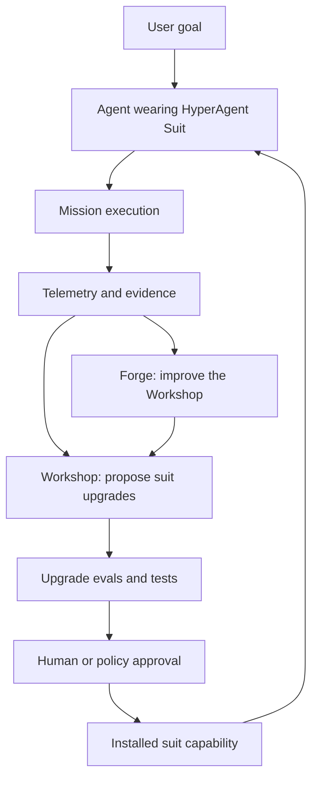

# HyperAgent PRD

## Product Summary

HyperAgent is an open source "Iron Man Suit" for AI agents: a self-improving exosystem that gives agents a richer body for doing real work.

The core thesis is:

> Models provide intelligence. HyperAgent provides agency.

HyperAgent is not a scaffold that compensates for today's model weaknesses. It is a model-agnostic harness that becomes more valuable as models get stronger: it gives agents durable tools, senses, memory, operating procedures, verification loops, safety policies, and the ability to improve those capabilities over time.

The first implementation target is OpenAI Codex running inside the Codex Mac app. HyperAgent should be an independent open source project that users can install into agent environments without relying on a separate project office, runtime, or distribution surface.

## Origin And Concept

The Iron Man suit is not essentially metal, flight, weapons, or the arc reactor. Its essence is a wearable system that converts intention into superhuman agency. It is powered armor, an intelligence amplifier, a self-contained second body, a personal system, and a solution to vulnerability.

HyperAgent translates that idea to AI agents.

An AI agent is intelligent but still limited by its body:

- What tools can it use?
- What can it sense?
- What can it remember?
- What actions can it safely take?
- How does it verify that work is actually done?
- How does it recover from failure?
- How does it learn from repeated friction?
- How does it upgrade itself without becoming reckless?

HyperAgent is the suit around the agent: a unified exosystem that externalizes model intention as reliable action.

## Strategic Positioning

Felix Rieseberg's warning is the right constraint: do not build brittle scaffolds that teach models how to do narrow tasks in ways that will quickly become obsolete as models improve.

HyperAgent should avoid encoding "today's workaround for today's weak model." Instead, it should build durable agency infrastructure:

- Capability discovery instead of fixed tool assumptions.
- Verification contracts instead of blind completion claims.
- Memory and promotion flows instead of context stuffing.
- Safety and policy layers instead of ad hoc permission prompts.
- Upgrade loops instead of static workflows.
- Meta-upgrade loops instead of a fixed self-improvement process.

The product claim:

> A scaffold decays as models improve. A suit evolves as agents act.

## Product Definition

HyperAgent is a self-improving agent exosystem that:

1. Converts model intention into reliable action.
2. Gives agents an integrated set of tools, memory, senses, and safety constraints.
3. Captures task outcomes and operational friction.
4. Turns repeated friction into proposed capabilities.
5. Tests and installs approved upgrades.
6. Improves the process by which it proposes, evaluates, and installs upgrades.

In short:

> The agent does the mission. The Workshop upgrades the suit. The Forge upgrades the Workshop.

## Target Users

### Primary User

An AI power user or builder who uses Codex, Claude Code, Cursor, OpenClaw, or similar agentic coding environments and wants agents that can operate more reliably across real projects.

### Secondary User

An open source contributor who wants to add new suit modules: integrations, skills, tools, safety policies, memory backends, evals, or visualizations.

### Future User

A small team that wants persistent AI teammates that improve how they work over time, while still maintaining clear human authority over dangerous or irreversible actions.

## Development Operating Model

HyperAgent should be built as a standalone open source product with clear local artifacts, inspectable behavior, and human review for persistent changes.

The repo should support several contributor roles without depending on a specific coordination tool:

- Product contributors can break the PRD into milestones and issues.
- Engineering contributors can implement HyperAgent modules.
- Research contributors can study agent platforms, Codex skills, MCP patterns, and related papers.
- QA contributors can run evals and verify behavior.
- Docs contributors can maintain README, articles, guides, and examples.
- Ops contributors can track releases, issues, contributor onboarding, and project health.

In this model:

- HyperAgent repo = the product source of truth.
- HyperAgent Suit = what end users install into their agent environment.
- HyperAgent Workshop = product capability for improving the suit.
- HyperAgent Forge = product capability for improving the Workshop.
- Mission records, proposals, and reviews = durable evidence for how the product learns.

This distinction is important: HyperAgent must remain independently useful, installable, and understandable from its own repository.

## Product Pillars

### 1. The Suit

The Suit is the installed operating layer an agent wears while doing work.

It should provide:

- A concise operating doctrine.
- Capability discovery.
- Tool usage policies.
- Task planning and execution conventions.
- Evidence-backed completion reporting.
- Safety modes.
- Per-platform adapters, starting with Codex Mac app.

### 2. The Mission Layer

The Mission Layer captures what happened during real work.

It should record:

- User request.
- Agent plan.
- Tools used.
- Files touched.
- Tests or checks run.
- Failures and retries.
- User corrections.
- Completion evidence.
- Unresolved risks.
- Candidate lessons.

The mission record should be structured enough for later analysis but simple enough that agents will reliably write it.

### 3. The Workshop

The Workshop turns task experience into suit upgrades.

Upgrade candidates may include:

- New Codex skills.
- New agent conventions.
- New scripts.
- New MCP tools.
- New verification checks.
- New memory promotion rules.
- New project templates.
- New safety gates.
- New docs or examples.

Each upgrade proposal should include:

- Observed failure or friction.
- Why the current suit was insufficient.
- Proposed capability.
- Expected benefit.
- Implementation plan.
- Test or eval.
- Activation policy.
- Rollback plan.

### 4. The Forge

The Forge improves the Workshop itself.

This is the Hyperagents-inspired layer: HyperAgent should not only improve the agent's capabilities, it should improve its own process for generating improvements.

The Forge studies questions like:

- Are upgrade proposals too vague?
- Are evals too weak?
- Are we approving too many low-value upgrades?
- Are we missing recurring failure patterns?
- Are safety gates blocking useful work or allowing risky work?
- Are Workshop reflections producing actionable changes?
- Are successful upgrades transferring across tasks, repos, or agents?

Forge upgrades may change:

- The upgrade proposal template.
- The prioritization rubric.
- The eval format.
- The telemetry captured after missions.
- The installation policy.
- The categories of capabilities the Workshop looks for.
- The way mission records, upgrade proposals, and accepted suit memory are used.

## Conceptual Architecture



## MVP Scope

The first public version should be small, concrete, and useful.

### MVP Goal

Give a Codex agent running in the Codex Mac app a repeatable way to:

1. Complete tasks with an explicit suit operating loop.
2. Record mission telemetry.
3. Generate after-action reflections.
4. Propose suit upgrades.
5. Store those proposals in local, inspectable project memory.
6. Produce one human-reviewable implementation plan for the highest-priority upgrade.

### MVP User Story

As a user, I can install HyperAgent into Codex, assign work to the agent, and after the task completes the agent writes a mission record and proposes concrete suit upgrades based on what slowed it down or made it less reliable.

### MVP Non-Goals

- Do not build autonomous self-modification without human approval.
- Do not train or fine-tune models.
- Do not attempt to support every agent platform on day one.
- Do not build a complex new UI before the underlying loop works in markdown.
- Do not encode brittle task-specific scaffolds as the core product.

## Functional Requirements

### Installable Operating Layer

HyperAgent must provide a Codex-compatible installation path that gives the Codex agent a HyperAgent operating layer.

The installation must include:

- Mission execution instructions.
- After-action reflection instructions.
- Workshop upgrade proposal instructions.
- Safety and approval defaults.
- Memory usage conventions for local mission records, upgrade proposals, and accepted suit knowledge.

### Mission Records

HyperAgent must define a mission record format.

Required fields:

- Mission ID.
- Date/time.
- User request.
- Agent identity.
- Environment.
- Summary of actions taken.
- Tools used.
- Files or systems changed.
- Verification performed.
- Failures, retries, and blockers.
- User corrections, if any.
- Suit friction observed.
- Candidate upgrades.
- Final outcome.

### Upgrade Proposals

HyperAgent must define an upgrade proposal format.

Required fields:

- Upgrade title.
- Problem observed.
- Evidence from mission records.
- Proposed capability.
- Type of upgrade.
- Expected impact.
- Safety risk.
- Eval or acceptance test.
- Rollback plan.
- Proposed activation mode.

Activation modes:

- Suggest only.
- Draft files only.
- Human review required.
- Auto-install low risk.

The MVP default should be human review required.

### Workshop Review Prompt

HyperAgent should provide a repeatable prompt or command that tells an agent to review recent mission records and propose upgrades.

This can start as a documented prompt before becoming a first-class CLI command or Codex skill action.

### Forge Review Prompt

HyperAgent should provide a repeatable prompt or command that tells an agent to review recent upgrade proposals and improve the Workshop process.

This can start as a documented prompt before becoming a first-class CLI command or Codex skill action.

### Memory Integration

HyperAgent should use local, file-based memory on day one rather than requiring a database or hosted service.

Recommended memory flow:

1. Mission telemetry is written to `missions/` or an equivalent local directory.
2. Upgrade proposals are written to `workshop/proposals/`.
3. Accepted upgrades are recorded in an installed capability registry.
4. Forge reviews are written to `forge/reviews/`.
5. Durable lessons are promoted into project docs or suit memory.
6. Upgrade proposals link back to mission records as evidence.

### Safety

HyperAgent must make the authority boundary explicit.

Default safety rules:

- Agents may propose upgrades freely.
- Agents may draft local low-risk upgrade files when asked.
- Agents may not silently activate upgrades that increase permissions.
- Agents may not silently alter secrets handling.
- Agents may not silently broaden filesystem, shell, network, deployment, or account access.
- Human approval is required for persistent behavior changes until the project defines stronger policy automation.

## UX Requirements

### First-Run Experience

The user should be able to install HyperAgent into Codex and see:

- A HyperAgent Codex skill or equivalent operating layer.
- A clear starting prompt.
- A place where mission records are written.
- A place where upgrade proposals are written.
- A visible indication that the suit is in "human review required" mode.

### User Mental Model

The product should consistently explain itself through three layers:

- Suit: helps the agent act.
- Workshop: improves the suit.
- Forge: improves the Workshop.

### Tone

The project should feel ambitious but practical: powered armor, not vaporware. Avoid overclaiming autonomy. Emphasize evidence, verification, and review.

## Open Source Distribution

Initial repo contents should include:

- `README.md`: category definition, quick start, Codex setup, safety model.
- `docs/hyperagent-prd.md`: this PRD.
- `docs/concepts.md`: Suit, Mission, Workshop, Forge.
- `docs/article-outline.md`: public essay draft.
- `skills/codex-hyperagent/`: Codex skill instructions.
- `hyperagent/`: local suit runtime, templates, and project conventions.
- `templates/mission-record.md`: mission telemetry template.
- `templates/upgrade-proposal.md`: Workshop proposal template.
- `templates/forge-review.md`: Forge review template.
- `evals/`: small tasks that test whether upgrades improve behavior.

## Success Metrics

### MVP Success

- A user can install HyperAgent into Codex with HyperAgent instructions.
- The agent completes at least one real task.
- The agent writes a usable mission record.
- The agent proposes at least one concrete, evidence-backed upgrade.
- The user can understand and approve or reject the proposed upgrade.

### Project Success

- Contributors can add new suit capabilities without rewriting the whole system.
- Agents become measurably more reliable across repeated tasks.
- The Workshop produces increasingly specific, testable upgrade proposals.
- The Forge improves the quality of the Workshop process over time.
- HyperAgent remains useful as underlying models become more capable.

## First Implementation Assignment

Work on this first:

```text
We are building HyperAgent: an open source Iron Man Suit for AI agents.

Your first task is not to implement a full product. Your first task is to create the smallest Codex-first HyperAgent prototype that proves the Mission -> Workshop loop.

Read these inputs first:
- docs/iron-man-suit-essence.md
- docs/hyperagent-prd.md
- Codex skill documentation or examples available locally in the project/developer environment.

Goal:
Create a minimal HyperAgent installable setup for Codex that lets an agent run with HyperAgent operating instructions, complete a task, write a mission record, and propose suit upgrades.

Deliverables:
1. Identify the right extension point for a Codex-first HyperAgent install, likely a Codex skill plus local project templates.
2. Add the minimal HyperAgent skill/config needed for a Codex-backed agent.
3. Add markdown templates for:
   - mission records
   - upgrade proposals
   - forge reviews
4. Add an initial HyperAgent operating prompt that defines:
   - Suit behavior during missions
   - Workshop behavior after missions
   - Forge behavior for improving the Workshop
   - safety defaults, with human review required for activation
5. Add a README or docs page explaining how to install and use HyperAgent with Codex.
6. Run the smallest local verification possible and document what works, what does not, and what should be built next.

Constraints:
- Do not build autonomous self-modification yet.
- Do not add new external dependencies unless required.
- Keep the prototype file-based and inspectable.
- Human approval is required before any upgrade is activated.

Definition of done:
I can install HyperAgent into Codex, assign a simple real task to the agent, and see a mission record plus at least one evidence-backed upgrade proposal written somewhere durable and easy to inspect.
```

## Next Milestones

### Milestone 1: HyperAgent Mark I

- Codex HyperAgent skill or equivalent installable operating layer.
- Codex-oriented operating prompt.
- Mission record template.
- Upgrade proposal template.
- Manual Workshop review prompt.
- Documentation for running the prototype.

### Milestone 2: Workshop

- First-class upgrade backlog.
- Proposal prioritization rubric.
- Upgrade acceptance tests.
- Human approval flow.
- Accepted upgrade registry.

### Milestone 3: Forge

- Forge review template.
- Metrics for proposal quality.
- Meta-upgrade proposal format.
- Process changes tracked as versioned artifacts.

### Milestone 4: Codex Mac App Distribution

- Installable Codex skill.
- Setup instructions optimized for Codex Mac users.
- Example video or walkthrough.
- A demo task showing the full Mission -> Workshop -> approved upgrade loop.

### Milestone 5: Multi-Platform Suit

Deferred until the Codex adapter boundary is reviewed. Future platform work should start from `adapters/contract.md` and preserve the current Codex-first alpha scope.

- Claude Code adapter.
- OpenClaw adapter.
- Cursor adapter.
- Platform capability registry.
- Cross-agent shared suit memory.

## References

- Iron Man Suit essence: `docs/iron-man-suit-essence.md`
- Hyperagents paper: https://arxiv.org/abs/2603.19461
